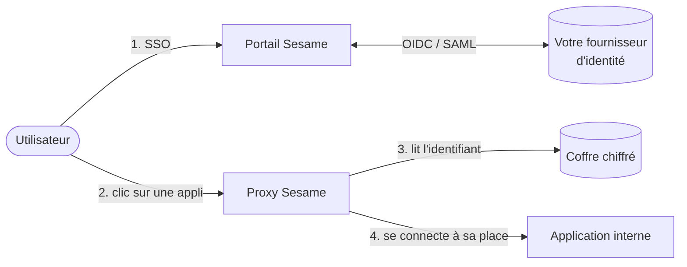

<p align="center"></p>

<p align="center"><strong>Le SSO pour les applications qui ne savent faire que « identifiant / mot de passe ».</strong></p>

<p align="center">
  <a href="LICENSE"></a>
  
  <a href="https://github.com/neoisback431/Sesame/releases"></a>
</p>

Vos utilisateurs se connectent **une seule fois** avec le compte de votre organisation
(Entra ID, Keycloak, Okta… en OIDC ou SAML). Sesame se connecte ensuite **à leur place**
aux applications internes qui n'ont qu'un formulaire de login, avec des identifiants
qu'ils ne voient jamais. **Aucun mot de passe applicatif n'atteint le navigateur**, et
chaque accès est tracé.

Aucune modification des applications, aucune extension de navigateur.

## Comment ça marche



1. L'utilisateur ouvre le portail et se connecte avec son compte habituel : il voit la liste de ses applications.
2. Chaque application est servie par Sesame à sa propre adresse (`compta.sesame.example.com`).
3. Au premier accès, le proxy lit l'identifiant de cet utilisateur pour cette appli dans le coffre chiffré…
4. …rejoue le formulaire de connexion côté serveur, garde la session et relaie les pages. Si la session expire, il se reconnecte tout seul.

---

## Installer

### Ce qu'il vous faut

| | |
|---|---|
| 🖥️ **Un serveur** | Linux avec Docker (Compose v2), joignable par vos utilisateurs, et qui joint vos applications internes |
| 🌐 **Un domaine** | ex. `sesame.example.com`, avec **deux** entrées DNS vers le serveur : `sesame.example.com` et `*.sesame.example.com` |
| 🔒 **Un certificat TLS** | couvrant `sesame.example.com` **et** `*.sesame.example.com` |
| 🔑 **Un fournisseur d'identité** | OIDC (Entra ID, Keycloak, Okta…), avec le droit d'y déclarer deux applications |

### 1. Récupérer le kit de déploiement

```sh
VERSION=v0.1.3   # dernière version : https://github.com/neoisback431/Sesame/releases
curl -fsSL https://github.com/neoisback431/Sesame/releases/download/$VERSION/sesame-deploy-$VERSION.tar.gz | tar -xz
cd sesame
```

Le kit contient seulement : `docker-compose.yml`, `.env.example`, `generate-keys.sh`,
la configuration Nginx et le dossier `certs/`. Il est aussi dans le dépôt :
[`deploy/release/`](deploy/release/).

### 2. Déclarer Sesame chez votre fournisseur d'identité

Créez **deux** applications (clients OIDC), une pour le portail et une pour
l'administration :

| Application | URL de retour (redirect URI) |
|---|---|
| Portail | `https://sesame.example.com/auth/callback` |
| Administration | `https://admin.sesame.example.com/auth/callback` |

Notez pour chacune son **identifiant** (client ID) et son **secret**. Faites émettre les
**groupes** dans le jeton (claim `groups`), et créez un groupe pour les administrateurs de
Sesame.

> **Entra ID** : App registrations → New registration, type *Web*, avec l'URL de retour
> ci-dessus ; secret dans *Certificates & secrets*. L'émetteur est
> `https://login.microsoftonline.com/<tenant-id>/v2.0`.
>
> - **Groupes** : dans l'application, ouvrez *Token configuration* → *Add groups claim*
>   (« Security groups »), pour les deux applications. Ou mettez
>   `"groupMembershipClaims": "SecurityGroup"` dans leur *Manifest*.
> - **Entra n'émet pas le nom des groupes mais leur GUID** (*Object Id* du groupe,
>   visible dans Entra ID → Groups). C'est ce GUID, et non le nom, qu'il faut mettre dans
>   `SESAME_ADMIN_GROUP` et dans les groupes des habilitations (`spec.access`).

### 3. Configurer

```sh
./generate-keys.sh     # crée .env et génère les clés et mots de passe
```

Ouvrez ensuite `.env` et renseignez **la section 1**, et c'est tout :

| Variable | Exemple | Où la trouver |
|---|---|---|
| `SESAME_DOMAIN` | `sesame.example.com` | votre domaine |
| `SESAME_OIDC_ISSUER` | `https://login.microsoftonline.com/<tenant-id>/v2.0` | votre fournisseur d'identité |
| `SESAME_OIDC_PORTAL_CLIENT_ID` / `_SECRET` | | application « Portail » de l'étape 2 |
| `SESAME_OIDC_ADMIN_CLIENT_ID` / `_SECRET` | | application « Administration » de l'étape 2 |
| `SESAME_ADMIN_GROUP` | `sesame-admins` | groupe des administrateurs : valeur du claim `groups`. **Entra ID : le GUID du groupe, pas son nom** |

Avec **Entra ID**, mettez aussi `SESAME_OIDC_USER_KEY_CLAIM=oid` (section 2).

> ⚠️ **Sauvegardez `.env`** : `SESAME_SECRETS_ENCRYPTION_KEY` chiffre les identifiants
> enregistrés. Si elle est perdue ou changée, ils deviennent illisibles.

### 4. Installer le certificat

Copiez votre certificat dans `certs/` sous ces deux noms :

```
certs/fullchain.pem    certificat (+ chaîne intermédiaire)
certs/privkey.pem      clé privée
```

### 5. Démarrer

```sh
docker compose up -d
```

| Adresse | |
|---|---|
| `https://sesame.example.com` | 🏠 **Portail** : la page « Mes applications » de vos utilisateurs |
| `https://admin.sesame.example.com` | 🛠️ **Administration** : réservée au groupe `SESAME_ADMIN_GROUP` |
| `https://<appli>.sesame.example.com` | 🔁 chaque application protégée |

**Mettre à jour** : changez `SESAME_VERSION` dans `.env`, puis
`docker compose pull && docker compose up -d`.

> ☁️ **Sur AWS** (ECS Fargate + RDS + ALB, en Terraform) : suivez plutôt le
> [kit AWS](deploy/aws/README.md). Les étapes 2 (fournisseur d'identité) et « Ajouter une
> application » restent les mêmes.

---

## Ajouter une application

Tout se fait dans l'administration (`https://admin.sesame.example.com`).

1. **Applications → Nouvelle application → Analyser une page de login** : indiquez l'URL
   de la page de connexion de l'appli (joignable depuis le serveur Sesame). Ajoutez un
   compte de test si vous en avez un : l'analyse sera plus complète.
2. **Continuer vers l'éditeur** : Sesame propose un descripteur, une fiche YAML qui décrit
   comment se connecter à l'appli. Relisez les points signalés, puis **Vérifier** et
   **Créer l'application**. Elle est servie à `https://<identifiant>.sesame.example.com`
   en une dizaine de secondes, sans redémarrage.
3. **Gérer les comptes → Enregistrer un compte** : pour chaque utilisateur, saisissez sa
   **clé utilisateur** (la valeur de son claim `sub`, ou son *Object ID* avec Entra ID)
   et **son identifiant et son mot de passe dans l'appli**. Ils sont chiffrés, et
   l'administration ne peut plus les relire.

L'utilisateur voit alors la tuile dans son portail et entre dans l'appli sans rien saisir.

**La connexion échoue ?** Mettez `SESAME_REPLAY_DEBUG=true` dans `.env` puis
`docker compose up -d` : l'administration affiche alors la réponse de l'appli au dernier
essai, valeurs sensibles masquées. Désactivez-le une fois l'appli au point. Référence
complète : [descripteur d'appli](docs/descriptor.md).

---

## Essayer ou développer (mode dev)

Pour découvrir Sesame en local, sans serveur ni fournisseur d'identité : un Keycloak de
démo et une application factice sont fournis.

```sh
git clone https://github.com/neoisback431/Sesame.git && cd Sesame
# Dans docker-compose.yml, décommentez le service « keycloak » et la ligne
# « keycloak: » du depends_on du portail, puis :
make up-demo
```

Ouvrez **https://sesame.localhost:8443** (certificat de dev : acceptez l'avertissement).

| Compte | Mot de passe | Ce que vous verrez |
|---|---|---|
| `alice` | `alice` | L'appli factice, ouverte **sans saisir** son compte applicatif |
| `carol` | `carol` | Une tuile grisée : habilitée mais sans compte (à créer dans l'administration) |
| `admin` | `admin` | L'administration : https://admin.sesame.localhost:8443 |

Commandes, tests et parcours détaillé : [environnement de dev](docs/dev.md) et
[guide de contribution](CONTRIBUTING.md).

---

## En savoir plus

**Fonctionnalités** : SSO OIDC ou SAML 2.0 · page « Mes applications » · rejeu des
formulaires HTML et des pages JavaScript, jetons CSRF compris · reconnexion transparente
à l'expiration · coffre PostgreSQL chiffré (AES-256-GCM) ou OpenBao / Vault · habilitations
par groupe · administration web · analyse automatique des pages de login · audit JSON de
chaque accès.

**Sécurité** : aucun mot de passe ni cookie applicatif vers le navigateur ; identifiants
lus par le seul proxy, jamais relisibles depuis l'administration ; audit de chaque lecture
de secret et de chaque connexion ; conçu pour un environnement PCI-DSS. Signaler une
vulnérabilité : [SECURITY.md](SECURITY.md).

**Limites** : pas de login en plusieurs étapes, de captcha ni de MFA côté application ;
en SAML, pas de déconnexion unique (Single Logout) ; projet en 0.x.

| Documentation | |
|---|---|
| [Configuration](docs/configuration.md) | toutes les variables, dont SAML |
| [Kit AWS](deploy/aws/README.md) | ECS Fargate, RDS, ALB (Terraform) |
| [Descripteur d'appli](docs/descriptor.md) | décrire une application à la main |
| [Architecture](docs/architecture.md) | composants, flux, modèle de menace |
| [Décisions](docs/decisions/) | le pourquoi de chaque choix |
| [Notes de version](CHANGELOG.md) | |

## Contribuer

Issues et pull requests bienvenues : lisez le [guide de contribution](CONTRIBUTING.md) et
le [code de conduite](CODE_OF_CONDUCT.md).

## Licence

[Apache-2.0](LICENSE)
