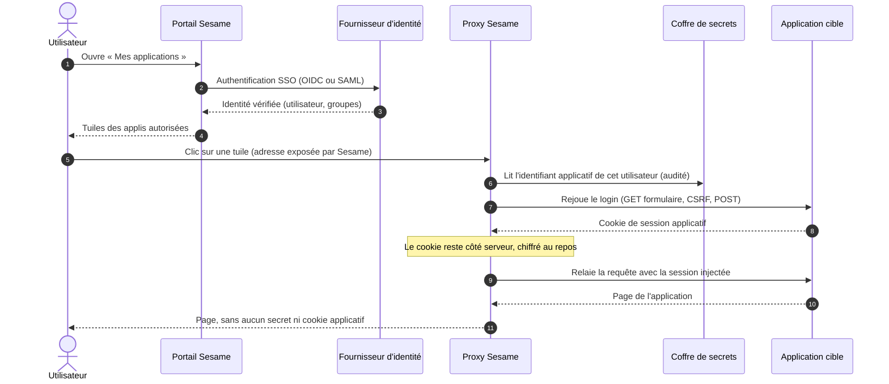

<p align="center"></p>

<p align="center">
  <strong>Le SSO pour les applications qui ne savent faire que « identifiant / mot de passe ».</strong>
</p>

<p align="center">
  <a href="LICENSE"></a>
  
  
  
  
</p>

---

## Pourquoi Sesame ?

Beaucoup d'applications web internes n'offrent **aucun** mécanisme d'authentification
fédérée : ni SAML, ni OIDC, ni en-tête d'identité, seulement un formulaire de connexion.
Résultat : des mots de passe applicatifs partagés, notés, réutilisés, et aucune maîtrise
centralisée des accès.

Sesame se place **devant** ces applications :

- l'utilisateur ne s'authentifie qu'**une seule fois**, auprès du fournisseur d'identité de
  son organisation (Entra ID, Keycloak, Okta… en **OIDC** ou **SAML 2.0**) ;
- il **ne connaît jamais** les identifiants des applications ;
- Sesame **rejoue la connexion côté serveur**, de façon transparente, avec des identifiants
  lus dans un coffre de secrets ;
- **aucun mot de passe ni cookie de session applicatif n'atteint le navigateur.**

Aucune modification des applications, aucune extension de navigateur.

## Comment ça marche



1. **Portail** : authentifie l'utilisateur auprès de l'IdP et affiche ses applications.
2. **Proxy** : chaque application a son propre nom d'hôte servi par Sesame
   (`compta.sesame.example`). À la première requête, le proxy lit l'identifiant de
   l'utilisateur dans le coffre, rejoue le formulaire de connexion selon le **descripteur**
   de l'appli (un fichier YAML), capture le cookie de session et le garde côté serveur.
3. **Ensuite**, chaque requête est relayée avec cette session. Si elle expire, le proxy
   rejoue le login tout seul, sans que l'utilisateur ne s'en aperçoive.

Détails : [architecture](docs/architecture.md).

## Fonctionnalités

### 🔑 Portail d'authentification
- SSO **OIDC** (discovery, code + PKCE) ou **SAML 2.0** (SP-initiated, signature toujours vérifiée), un protocole par déploiement.
- Page **« Mes applications »** : tuiles ouvertes dans un nouvel onglet, bouton « Déconnecter » par appli, tuile grisée quand l'utilisateur est habilité sans avoir de compte.
- Habilitations par groupes ou utilisateurs issus de l'IdP (facultatives : par défaut, avoir un compte suffit).
- Déconnexion globale (toutes les sessions applicatives détruites), et déconnexion chez l'IdP en option.

### 🔁 Moteur de proxy et rejeu
- Rejeu de formulaires HTML **et** de pages de login construites en JavaScript (appel JSON direct).
- Jetons CSRF : champ caché, balise meta, cookie, motif dans le HTML ou appel d'API préalable.
- Détection d'expiration (redirection, statut, marqueur) et **rejeu transparent** ; un `POST` expiré est rejoué puis redirigé sans double soumission.
- Réécriture des redirections et URLs absolues des applis.
- Mode **« remise » (handoff)**, facultatif et par appli, pour les applis qui gardent leur session dans le navigateur (jeton en stockage local) : le mot de passe, lui, n'est jamais remis.

### 🔒 Sécurité et conformité
- Coffre de secrets : **PostgreSQL chiffré (AES-256-GCM)** par défaut, ou OpenBao / Vault.
- Identifiants **par utilisateur et par appli** ; seul le proxy peut les lire, l'administration ne peut que les écrire.
- **Audit** de chaque lecture de secret, rejeu, connexion et action d'administration (JSON, prêt pour un SIEM).
- Jetons de session portail hachés, cookies applicatifs chiffrés au repos, secrets jamais journalisés (types masqués, tests de non-fuite).
- Conçu pour un environnement soumis à **PCI-DSS**.

### 🛠️ Administration (UI web)
- Gestion des applications (fichiers Git en lecture seule **ou** créées dans l'interface, historisées, rechargées à chaud sans redémarrage).
- Registre des comptes : ajout, désactivation (y compris en masse), suppression, révocation des sessions ouvertes.
- **Diagnostic des rejeux en échec** (dernière réponse de l'appli, valeurs sensibles masquées).
- Réservée à un groupe d'administrateurs, authentifiée par le même IdP.

### 🧭 Embarquement d'une nouvelle application
- **Recorder** : à partir de l'URL de la page de login, analyse le formulaire dans un Chromium headless et **propose un descripteur** prêt à relire. Avec un compte de test facultatif, il observe une vraie connexion (cookie de session, réponse de succès, jetons).
- Disponible en ligne de commande (`sesame-onboard`) et d'un clic dans l'administration.
- `verify` (rejoue un descripteur avec les règles exactes du proxy) et `health` (alerte si le formulaire de login d'une appli a changé).

## Garanties

| Principe | Mise en œuvre |
|---|---|
| Aucun mot de passe applicatif vers le navigateur | Rejeu 100 % côté serveur ; pages d'erreur génériques avec identifiant de corrélation |
| Secrets en mémoire le temps du rejeu seulement | Lus dans le coffre par le seul proxy, effacés après usage |
| Cookies applicatifs côté serveur | Tous les `Set-Cookie` des applis sont capturés ; le navigateur ne détient que le cookie du portail |
| Traçabilité | Événement d'audit pour chaque accès à un secret et chaque rejeu, y compris en échec |
| Aucun logiciel sur le poste | Pas d'extension de navigateur |

Exceptions assumées et documentées : le mode *handoff* (facultatif, par appli) et la
vérification TLS vers les applis amont, désactivée par défaut pour les PKI internes
(voir [décisions](docs/decisions/)).

## Démarrage rapide

Prérequis : Docker (Compose v2), `make`, `openssl`.

```sh
git clone https://github.com/neoisback431/Sesame.git && cd Sesame
make up-demo
```

Puis ouvrez **https://sesame.localhost:8443** (certificat de dev : acceptez l'avertissement ou
importez `deploy/nginx/certs/ca.crt`).

| Compte | Mot de passe | Ce que vous verrez |
|---|---|---|
| `alice` | `alice` | L'appli factice, ouverte **sans jamais saisir** son compte applicatif |
| `carol` | `carol` | La tuile grisée : habilitée mais sans compte (à créer dans l'administration) |
| `bob` | `bob` | Aucune appli : accès refusé |
| `admin` | `admin` | Le lien « Administration » (https://admin.sesame.localhost:8443) |

Toutes ces valeurs sont publiques et réservées au dev. Parcours guidé complet :
[environnement de dev](docs/dev.md).

## Déployer

Images publiées sur GitHub Container Registry à chaque release :

| Image | Rôle |
|---|---|
| `ghcr.io/neoisback431/sesame-portal` | Portail d'authentification |
| `ghcr.io/neoisback431/sesame-proxy` | Moteur de proxy (seul à lire le coffre) |
| `ghcr.io/neoisback431/sesame-admin` | Interface d'administration |
| `ghcr.io/neoisback431/sesame-recorder` | Service interne d'analyse des pages de login (facultatif, jamais exposé) |

Il vous faut aussi PostgreSQL, un frontal TLS (Nginx fourni en exemple) et votre fournisseur
d'identité. Toute la configuration passe par des variables d'environnement :
[configuration](docs/configuration.md). Chaque application se décrit dans un
[descripteur](docs/descriptor.md) YAML.

## Briques interchangeables

| Brique | Par défaut | Alternatives |
|---|---|---|
| Fournisseur d'identité | OIDC | SAML 2.0 ; Entra ID, Keycloak, Okta, Authentik, Dex… |
| Coffre de secrets | PostgreSQL chiffré | OpenBao, Vault |
| Magasin de sessions | PostgreSQL | En mémoire (tests) |
| Journal d'audit | JSON sur la sortie standard | Tout collecteur de logs / SIEM |

Le cœur ne dépend d'aucun fournisseur : chaque brique est derrière une interface.

## Limites connues

- Hors périmètre : login en **plusieurs étapes**, **captcha**, **MFA** côté application.
- SAML : pas de Single Logout ni d'IdP-initiated SSO pour l'instant.
- Pas encore d'export OpenTelemetry (logs JSON uniquement).
- Projet jeune (0.1.0) : l'API de configuration et le format des descripteurs peuvent encore évoluer.

## Documentation

- [Architecture](docs/architecture.md) : composants, flux, modèle de menace
- [Descripteur d'appli](docs/descriptor.md) : décrire une application à protéger
- [Configuration](docs/configuration.md) : toutes les variables d'environnement
- [Environnement de dev](docs/dev.md) : démarrer, tester, parcours guidé
- [Décisions d'architecture](docs/decisions/) : le pourquoi de chaque choix (ADR)
- [Notes de version](CHANGELOG.md)

## Contribuer

Les contributions sont les bienvenues : lisez le [guide de contribution](CONTRIBUTING.md)
(règles pour les issues et les pull requests) et le [code de conduite](CODE_OF_CONDUCT.md).

**Vulnérabilité ?** Ne l'ouvrez pas en issue publique : suivez la
[politique de sécurité](SECURITY.md).

## Structure du dépôt

| Dossier | Contenu |
|---|---|
| `crates/sesame-core` | Cœur Rust : descripteurs, interfaces des briques externes, types secrets, audit |
| `crates/sesame-portal` | Portail d'authentification (OIDC / SAML) |
| `crates/sesame-proxy` | Moteur de proxy et de rejeu |
| `crates/sesame-store-postgres` | Sessions, registre des comptes, coffre, descripteurs en base (PostgreSQL) |
| `crates/sesame-secrets-openbao` | Coffre OpenBao / Vault (alternative) |
| `admin/` | Interface d'administration (Python, FastAPI) |
| `onboarding/` | Embarquement : `sesame-onboard` et service `sesame-recorder` |
| `schemas/` | Schéma JSON du descripteur (fait foi) |
| `descriptors/` | Descripteurs d'exemple |
| `deploy/` | Nginx, Dockerfiles |
| `dev/` | Appli factice, realm Keycloak, jeux de données de dev |
| `docs/` | Documentation et ADR |
| `tests/e2e/` | Tests bout en bout (Playwright) |

## Licence

Sesame est distribué sous licence [Apache-2.0](LICENSE). Voir aussi [NOTICE](NOTICE).
