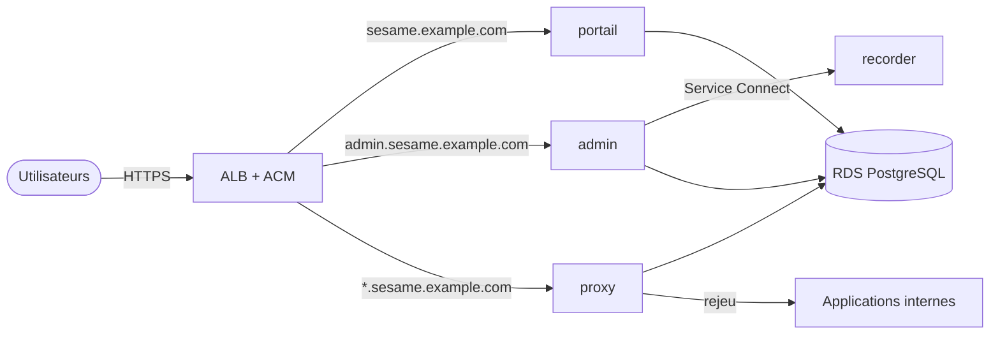

<!-- SPDX-License-Identifier: Apache-2.0 -->
# Déployer Sesame sur AWS (ECS Fargate + RDS)

Kit Terraform (ou OpenTofu) : les quatre services de Sesame sur **ECS Fargate**, la base
sur **RDS PostgreSQL**, un **Application Load Balancer** avec certificat **ACM** à la
place de Nginx. Même fonctionnement que le kit Docker Compose (`deploy/release/`), mêmes
adresses.



## Ce qu'il vous faut

| | |
|---|---|
| 🧰 **Terraform ≥ 1.6** ou OpenTofu | avec des identifiants AWS capables de créer ECS, RDS, ALB, IAM, Secrets Manager |
| 🌐 **Un VPC existant** | deux sous-réseaux privés (deux zones) **avec sortie Internet** (NAT : images, fournisseur d'identité), qui joignent vos applications internes |
| 🔒 **Le domaine** | une zone Route 53 (certificat et DNS créés pour vous) **ou** un certificat ACM existant couvrant `sesame.example.com` et `*.sesame.example.com` |
| 🔑 **Un fournisseur d'identité** | OIDC, deux applications déclarées (voir le [README principal](../../README.md#2-déclarer-sesame-chez-votre-fournisseur-didentité)) |
| 📦 **Les images** | publiques sur GHCR, ou recopiées dans ECR (`image_registry`) si vos tâches ne sortent pas vers Internet |

## Installer

```sh
# Kit versionné joint à chaque Release (ou dossier deploy/aws/ du dépôt)
VERSION=v0.1.4
curl -L https://github.com/neoisback431/Sesame/releases/download/$VERSION/sesame-aws-$VERSION.tar.gz | tar xz
cd sesame-aws

cp terraform.tfvars.example terraform.tfvars   # puis renseigner la section 1
terraform init
terraform apply
```

Les valeurs à renseigner dans `terraform.tfvars` :

| Variable | Exemple | Rôle |
|---|---|---|
| `region` | `eu-west-3` | région AWS |
| `domain` | `sesame.example.com` | portail ; `admin.<domain>` ; `<appli>.<domain>` |
| `vpc_id`, `private_subnet_ids` | | réseau des tâches et de la base |
| `alb_subnet_ids` | | sous-réseaux de l'ALB (privés s'il est interne, le défaut) |
| `route53_zone_id` **ou** `certificate_arn` | | certificat ACM (et DNS si zone Route 53) |
| `oidc_issuer` | `https://login.microsoftonline.com/<tenant-id>/v2.0` | émetteur OIDC |
| `oidc_portal_client_id` / `_secret` | | application « portail » chez l'IdP |
| `oidc_admin_client_id` / `_secret` | | application « administration » chez l'IdP |

Entra ID : `oidc_user_key_claim = "oid"` et `admin_group` = **GUID du groupe** des
administrateurs (son *Object Id*, pas son nom : Entra n'émet que les GUID). Dans les
deux applications Entra, activez aussi les groupes : *Configuration du jeton* → *Ajouter une
revendication de groupes*, ou `"groupMembershipClaims": "SecurityGroup"` dans le manifeste. Toutes les options sont décrites dans [`variables.tf`](variables.tf).

À la fin, `terraform output` affiche les adresses du portail et de l'administration, et les
URL de retour à déclarer chez l'IdP. Sans zone Route 53, créez vous-même deux
enregistrements `sesame.example.com` et `*.sesame.example.com` vers `alb_dns_name`.

Premier démarrage : quelques minutes (création de RDS, puis migrations de la base par le
portail et le proxy). Ajoutez ensuite vos applications depuis l'administration, comme
décrit dans le [README principal](../../README.md#ajouter-une-application).

## Ce qui est créé

| Ressource | Détail |
|---|---|
| ECS Fargate | cluster, services `portal`, `proxy`, `admin`, `recorder` (facultatif : `recorder_enabled`), redéploiement annulé automatiquement si une version ne démarre pas |
| RDS PostgreSQL 17 | privé, chiffré, sauvegardes 7 jours, protégé contre la suppression, instantané final |
| ALB + ACM | TLS 1.2/1.3, HTTP → HTTPS, routage par nom d'hôte ; interne par défaut, ouvert aux seules plages `allowed_cidrs` |
| Secrets Manager | `<name>/config` : clés de chiffrement générées, connexion à la base, secrets OIDC ; injectés dans les tâches, jamais en clair dans leur définition |
| CloudWatch Logs | `/ecs/<name>`, logs JSON et journal d'audit (`"log_type":"audit"`), rétention `log_retention_days` (365 j) |
| Groupes de sécurité | ALB ← utilisateurs ; tâches ← ALB ; base ← tâches seulement |

Les tâches n'ont aucun rôle IAM : Sesame n'appelle aucune API AWS. Seul le rôle
d'exécution ECS lit le secret de configuration.

## Exploiter

- **Mettre à jour** : `sesame_version = "vX.Y.Z"` puis `terraform apply` (ou `terragrunt apply`). La version est fixée volontairement : avec `latest`, la définition de tâche ne change pas et rien n'est redéployé.
- **Forcer un redéploiement à version identique** : `aws ecs update-service --cluster <name> --service <portal|proxy|admin|recorder> --force-new-deployment`.
- **Mettre au point une appli** : `replay_debug = true` (réponse de l'appli au dernier
  rejeu en échec, visible dans l'administration), à repasser à `false` ensuite.
- **Plusieurs proxys** : `proxy_desired_count` (les sessions sont en base).
- **Production** : `db_multi_az = true`, et une classe d'instance plus grande que
  `db.t4g.micro` selon le nombre d'utilisateurs.

## ⚠️ À savoir

- **L'état Terraform contient des secrets** (clés de chiffrement, mot de passe de la
  base, secrets OIDC) : stockez-le dans un backend chiffré à accès restreint (S3 chiffré,
  voir `versions.tf`), jamais dans Git. Idem pour `terraform.tfvars`.
- **Ne régénérez jamais `secrets_encryption_key`** (`random_bytes`) : les identifiants
  applicatifs déjà enregistrés deviendraient illisibles.
- `terraform destroy` est bloqué par `db_deletion_protection` ; le passer à `false`
  supprime la base (un instantané final est conservé).
- Seul OIDC est préconfiguré ici ; pour SAML, ajoutez les variables `SESAME_SAML_*`
  ([configuration](../../docs/configuration.md)) aux services `portal` et `admin` dans
  `ecs.tf`.
