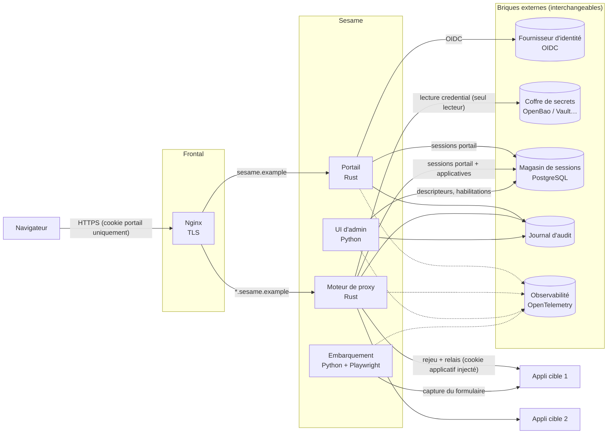
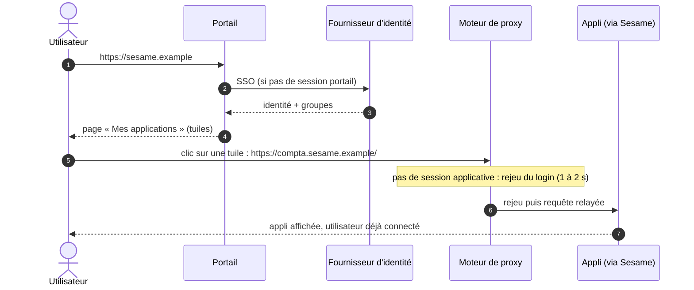
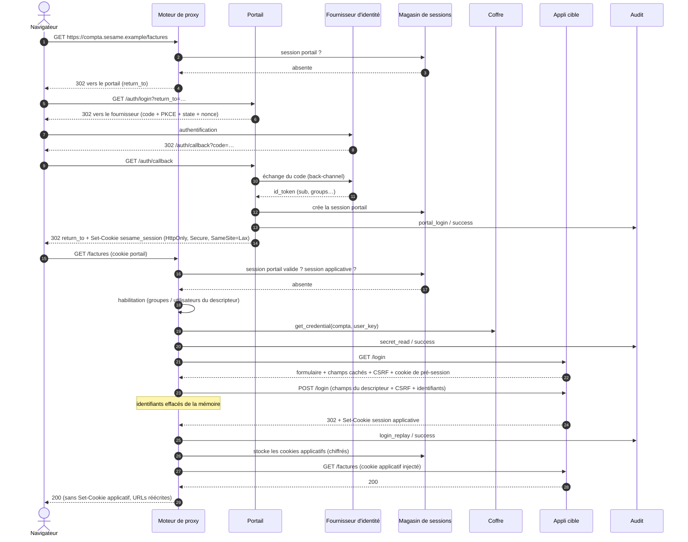
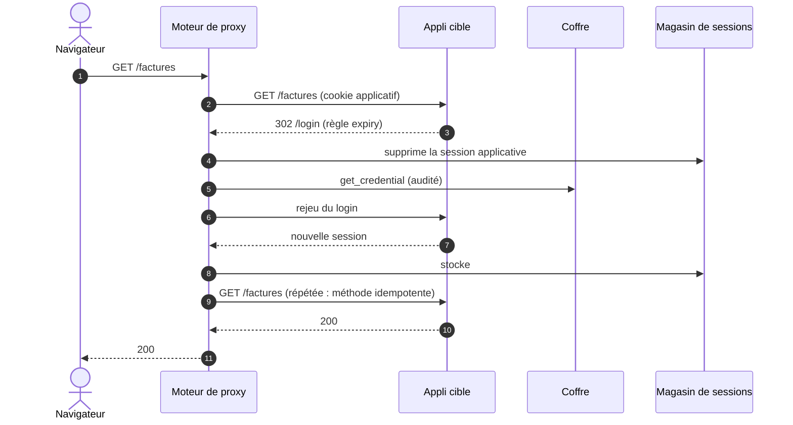

# Architecture de Sesame

Sesame est un portail SSO placé devant des applications web qui n'offrent qu'un formulaire login / mot de passe. L'utilisateur s'authentifie une seule fois auprès du fournisseur d'identité de l'organisation (OIDC). Sesame rejoue ensuite côté serveur la connexion à chaque application, avec des identifiants que l'utilisateur ne voit jamais.

Ce document décrit l'architecture cible. Les principes non négociables et les décisions sont dans [`CLAUDE.md`](../CLAUDE.md) et [`docs/decisions/`](decisions/).

## Vue d'ensemble

| Composant | Rôle | Accès aux secrets applicatifs |
|---|---|---|
| Nginx | Terminaison TLS, routage par nom d'hôte | Aucun |
| Portail | OIDC, session portail, page « Mes applications », déconnexion | Aucun |
| Moteur de proxy | Relais, rejeu du login, injection de session, détection d'expiration | **Seul lecteur du coffre** |
| Magasin de sessions | Session portail → sessions applicatives (cookies chiffrés) | Cookies applicatifs (chiffrés) |
| UI d'administration | Applis, descripteurs, habilitations, registre des comptes | Écriture seule, sans relecture (voir plus bas) |
| Module d'embarquement | Capture du formulaire, génération de descripteur, test de santé | Compte de test fourni ponctuellement |

## Parcours utilisateur

1. L'utilisateur se connecte au portail en SSO.
2. Le portail affiche la page **« Mes applications »** : une tuile par appli pour laquelle l'utilisateur est **habilité** (groupes / utilisateurs du descripteur) **et** possède un **compte actif** dans le registre des comptes. Les applis sans compte sont masquées.
3. Un clic sur une tuile ouvre l'adresse de l'appli **exposée par Sesame** (`compta.sesame.example`), jamais son adresse réelle : tout le trafic passe par le proxy, et les cookies applicatifs restent côté serveur.
4. Le proxy constate l'absence de session applicative et rejoue le login à ce moment-là. C'est le même mécanisme que pour une session expirée, donc un seul chemin de code.
5. L'utilisateur arrive dans l'appli, déjà connecté.

Compléments :

- **Accès direct** : un favori ou un lien profond (`https://compta.sesame.example/factures/42`) fonctionne aussi. SSO si nécessaire, rejeu, puis la page demandée.
- **Échec du rejeu** : le proxy affiche une page d'erreur neutre (identifiant de corrélation, lien de retour au portail) et passe le compte à l'état `failed` dans le registre. La tuile le signale jusqu'à ce qu'un administrateur corrige le compte.
- **Retour au portail** : par son adresse, ou via le lien des pages d'erreur. Sesame n'injecte pas de bandeau dans les pages des applis, ce serait fragile et risqué.
- **Déconnexion** : se déconnecter du portail détruit la session portail et toutes les sessions applicatives. Fermer aussi la session chez le fournisseur d'identité (RP-initiated logout) sera une option de configuration, désactivée par défaut (pas encore implémentée).

## Registre des comptes

Le portail doit savoir quelles applis afficher sans accéder au coffre : seul le proxy le lit. Un **registre des comptes**, dans PostgreSQL, indique pour chaque couple (appli, utilisateur) qu'un compte applicatif existe, avec son état. Il ne contient **aucun secret**.

| État | Sens | Tuile | Rejeu |
|---|---|---|---|
| `active` | Compte provisionné | Affichée | Autorisé |
| `failed` | Dernier rejeu en échec (identifiants refusés, formulaire changé…) | Affichée, signalée | Bloqué jusqu'à correction |
| `disabled` | Désactivé par un administrateur | Masquée | Bloqué |

- **Source** : l'UI d'admin. Elle écrit le secret dans le coffre (sans pouvoir le relire) et crée ou met à jour l'entrée du registre dans la même opération.
- **Proxy** : avant de lire le coffre, il vérifie l'habilitation et l'état `active` du compte. Sinon, il refuse sans lire le coffre et émet `access_denied`. Après un rejeu, il met à jour `last_login_at` ou passe le compte à `failed`.
- Le registre et le coffre peuvent diverger (secret supprimé à la main, par exemple). La lecture du coffre en échec passe alors le compte à `failed`.

## Routage : une appli par nom d'hôte

Chaque appli protégée est exposée sous son propre nom d'hôte (`spec.public.host`), par exemple `compta.sesame.example`. Le proxy choisit l'appli d'après l'en-tête `Host`.

Ce choix évite de réécrire les chemins (`/app1/...`). Les applis anciennes cassent souvent sous un préfixe (liens absolus, cookies `Path=/`, JavaScript). La réécriture se limite aux URLs absolues internes (`http://app-interne:8000/...`) dans `Location` et, si le descripteur le demande, dans le corps HTML.

Le portail vit sur le domaine parent (`sesame.example`). Son cookie est posé pour ce domaine et reçu par tous les sous-domaines. Le proxy le retire avant de relayer une requête et capture tous les `Set-Cookie` des applis (voir [ADR 0008](decisions/0008-routage-par-nom-d-hote.md)).

## Flux nominal

## Expiration de la session applicative

Le proxy examine chaque réponse relayée avec les règles `spec.expiry` du descripteur : redirection vers la page de login, code 401, marqueur dans le corps…

Règles :

- Seules les requêtes idempotentes (`GET`, `HEAD`, `OPTIONS`) sont répétées automatiquement. Pour un `POST` expiré, Sesame rejoue le login puis redirige l'utilisateur (`303`) vers la page d'origine (`Referer` s'il désigne la même appli, sinon la racine de l'appli). La soumission est perdue, ce qui évite toute double soumission. Un message l'explique à l'utilisateur.
- **Un seul rejeu à la fois** par couple (session portail, appli). Les requêtes concurrentes attendent le résultat.
- **Protection contre le verrouillage de compte** : au plus `login.max_attempts` rejeux consécutifs. Après un échec (règle `login.failure` ou absence de `login.success`), le couple (appli, utilisateur) passe en attente avec un délai croissant et une page d'erreur neutre s'affiche. Cette page ne contient jamais le contenu de la réponse de l'appli.

## Magasin de sessions (PostgreSQL)

Schéma : [`crates/sesame-store-postgres/migrations/`](../crates/sesame-store-postgres/migrations/). Les migrations sont appliquées au démarrage du portail et du proxy (verrou consultatif, sûr en parallèle).

| Table | Contenu |
|---|---|
| `portal_sessions` | Empreinte SHA-256 du jeton du cookie (jamais le jeton), identité, groupes, échéance |
| `app_sessions` | Jar de cookies applicatifs **chiffré** (AES-256-GCM, lié par AAD au couple session / appli), dates, échéance ; `ON DELETE CASCADE` depuis la session portail |
| `app_accounts` | Registre des comptes (voir plus haut), sans secret |

- **Jeton portail** : 256 bits aléatoires dans le cookie. La base n'en stocke que le hash, si bien qu'une fuite de la base ne permet pas de voler des sessions.
- **Cookies applicatifs chiffrés au repos**, avec une clé fournie par configuration. Un fournisseur de clé (KMS, coffre) sera branché derrière une interface.
- **Déconnexion du portail** : suppression de la session portail, puis `ON DELETE CASCADE` sur les sessions applicatives.
- **Purge** : le proxy supprime toutes les 5 minutes les sessions dont `expires_at` est passé. PostgreSQL n'a pas de TTL natif.
- **Durées de vie** : la session applicative expire au plus tôt des trois échéances `session.max_ttl`, `session.idle_ttl` et fin de la session portail.

## Coffre de secrets

- Interface `SecretStore::get_credential(app_id, user_key)`. Implémentation de référence : OpenBao / Vault (KV v2).
- Chemin : `<mount>/sesame/apps/<app_id>/users/<user_key>`. Les clés (`username`, `password`…) sont celles listées dans `spec.credentials.keys`.
- Le moteur de proxy s'authentifie par AppRole et sa policy se limite à la lecture de `sesame/apps/*`. L'UI d'admin a une policy d'écriture sans lecture (`create`, `update`, `delete`) : un administrateur peut définir un mot de passe sans pouvoir le relire.
- `user_key` provient d'un claim configurable. On privilégie un identifiant immuable (`sub`, ou `oid` pour Entra ID) plutôt que l'e-mail ou le nom d'utilisateur, qui peuvent être réattribués.
- En mémoire, les identifiants sont portés par des types qui ne s'affichent jamais et sont effacés à la destruction (`secrecy` / `zeroize`). Ils vivent le temps du rejeu uniquement.

## Hygiène des en-têtes dans le proxy

| Sens | Traitement |
|---|---|
| Navigateur → appli | Retirer le cookie du portail et tout cookie non géré, puis injecter les cookies applicatifs. Retirer `Authorization` venant du navigateur. Réécrire `Host` si `upstream.host_header` est défini. |
| Appli → navigateur | Capturer **tous** les `Set-Cookie` dans le jar côté serveur ; aucun n'atteint le navigateur. Réécrire `Location`. Réécrire les URLs absolues internes du corps si demandé. |
| Erreurs | Pages d'erreur génériques de Sesame, avec un identifiant de corrélation. Jamais de contenu de l'appli lors d'un échec de rejeu. |

## Audit

Chaque lecture de secret et chaque rejeu produit un événement, succès ou échec. L'écriture d'audit fait partie de l'opération : si l'audit échoue, l'opération échoue.

| Action | Émis par | Quand |
|---|---|---|
| `portal_login` / `portal_logout` | Portail | Session portail créée / détruite |
| `access_denied` | Proxy | Utilisateur non habilité, ou compte absent / inactif dans le registre |
| `account_status_changed` | Proxy, UI d'admin | Changement d'état d'un compte du registre (`active`, `failed`, `disabled`) |
| `secret_read` | Proxy | Lecture du coffre (succès ou échec) |
| `login_replay` | Proxy | Rejeu du login (succès, échec, abandon) |
| `app_session_expired` | Proxy | Expiration détectée |
| `app_logout` | Proxy | Chemin de déconnexion de l'appli appelé |

Champs : horodatage UTC, action, résultat, acteur (`issuer` + `subject`), appli, identifiant de corrélation, raison courte. Jamais de secret, de cookie ni de contenu de réponse.

## Fournisseur d'identité

- OIDC générique : discovery (`/.well-known/openid-configuration`), flux *authorization code* avec PKCE, vérification de `state`, `nonce`, `iss`, `aud` et de la signature.
- L'état de la connexion en cours (`state`, `nonce`, vérificateur PKCE, `return_to`) voyage dans un cookie chiffré (AES-256-GCM, 10 minutes, `Path=/auth`) : le portail reste sans état et peut être répliqué.
- `return_to` n'accepte que le portail et les hôtes publics déclarés dans les descripteurs, avec le même schéma : pas de redirection ouverte.
- Mapping de claims configurable : `user_key` (défaut `sub`), `groups` (défaut `groups`), libellé (`email`, `name`). Un claim `groups` absent vaut « aucun groupe ».
- Particularités d'Entra ID gérées par configuration : `oid` comme clé, identifiants de groupes (GUID) dans le claim `groups`, *groups overage* au-delà de 200 groupes. Ce dernier cas relève d'un module optionnel, hors du cœur.
- En dev : Keycloak (realm `sesame`, voir `dev/keycloak/`).

## Module d'embarquement

1. Un administrateur fournit l'URL de login et un compte de test.
2. Playwright effectue une connexion réelle et observe les formulaires, les champs cachés, les jetons CSRF (input, meta, cookie), la requête de login, la redirection et les cookies posés.
3. Le module génère un descripteur conforme au schéma et une empreinte de la structure du formulaire (`health.form_fingerprint`).
4. Un humain relit le descripteur, puis le valide dans l'UI d'admin ou par merge request.
5. En tâche périodique, le module recalcule l'empreinte et alerte en cas d'écart.

Hors périmètre initial : login en plusieurs étapes, captcha, MFA applicatif.

## Observabilité

- Logs JSON sur stdout (Rust : `tracing`). Aucun secret, aucun cookie, pas de query string dans les logs d'accès.
- Métriques et traces via OpenTelemetry (OTLP), exploitables par Datadog, Prometheus, etc.
- Métriques clés : rejeux (succès / échec, par appli), latence du rejeu, expirations détectées, erreurs du coffre, sessions actives.

## Modèle de menace (résumé)

| Menace | Mesure |
|---|---|
| Vol du cookie portail | `HttpOnly`, `Secure`, `SameSite=Lax`, durée limitée, liaison optionnelle à l'empreinte TLS / IP à étudier |
| Fuite de la base de sessions | Jetons portail hachés, cookies applicatifs chiffrés |
| Fuite de secret via logs / erreurs | Types secrets non affichables, tests de non-fuite, pages d'erreur génériques |
| Appli compromise qui pose des cookies sur le domaine parent | Tous les `Set-Cookie` sont capturés par le proxy et n'atteignent jamais le navigateur |
| Verrouillage de compte par rejeux en boucle | `max_attempts`, attente à délai croissant, alerte |
| Élévation via l'UI d'admin | Groupe d'administrateurs dédié, audit de chaque action, écriture sans relecture des secrets |
| Accès direct aux applis sans passer par Sesame | Hors de Sesame : filtrage réseau recommandé (seul le proxy joint les applis) |

## Environnement de dev

Voir [`docs/dev.md`](dev.md).
